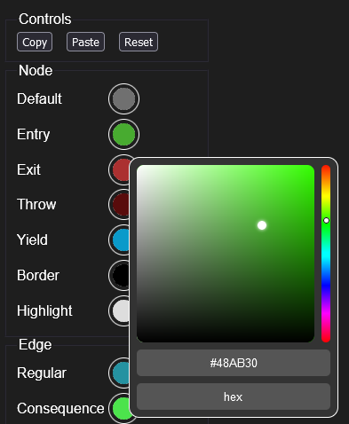
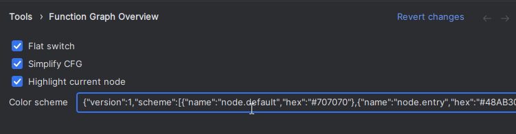
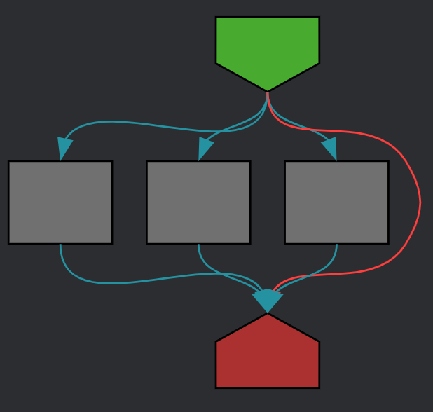
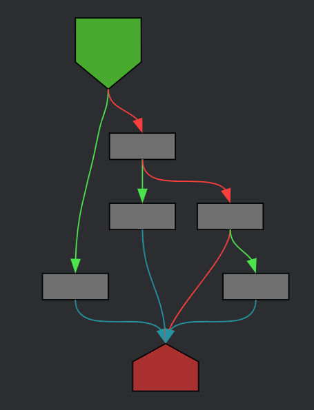

# Function Graph Overview (for JetBrains IDEs)

<!--
## Template ToDo list
- [ ] Set the [Plugin Signing](https://plugins.jetbrains.com/docs/intellij/plugin-signing.html?from=IJPluginTemplate) related [secrets](https://github.com/JetBrains/intellij-platform-plugin-template#environment-variables).
- [ ] Set the [Deployment Token](https://plugins.jetbrains.com/docs/marketplace/plugin-upload.html?from=IJPluginTemplate).
-->

<!-- Plugin description -->
See live control-flow-graphs of your code!

This plugin adds a CFG ([Control-Flow-Graph](https://en.wikipedia.org/wiki/Control-flow_graph))
view for the current function.

Before installing, you can also try an [interactive demo](https://tmr232.github.io/function-graph-overview/).

The plugin currently supports Python, C, C++, Go, TypeScript & TSX, JavaScript & JSX.

<!-- Plugin description end -->

|  |  |
|----------------------------------------------------|---------------------------------------------------------|

This is a port of the [Function-Graph-Overview](https://github.com/tmr232/function-graph-overview/) to JetBrains IDEs.

## Installation

- Using the IDE built-in plugin system:

  <kbd>Settings/Preferences</kbd> > <kbd>Plugins</kbd> > <kbd>Marketplace</kbd> > <kbd>Search for "Function Graph
  Overview"</kbd> >
  <kbd>Install</kbd>

- Using JetBrains Marketplace:

  Go to [JetBrains Marketplace](https://plugins.jetbrains.com/plugin/25676) and install it by clicking the <kbd>Install
  to ...</kbd> button in case your IDE is running.

  You can also download the [latest release](https://plugins.jetbrains.com/plugin/25676/versions) from JetBrains
  Marketplace and install it manually using
  <kbd>Settings/Preferences</kbd> > <kbd>Plugins</kbd> > <kbd>⚙️</kbd> > <kbd>Install plugin from disk...</kbd>

## Getting Started

If the graph window doesn't shop up immediately after installation, then:

1. Go to the main menu and click `View -> Tool Windows -> Function Graph Overview`.
2. Or open the Search Everywhere popup (double-click <kbd>Shift</kbd>, or click the 🔍 icon at the top-right of the IDE
   window) and search for `Function Graph Overview`.

## Settings

### Color Scheme

To change the color scheme of the CFG, open the settings and go to `Tools -> Function Graph Overview`.

In the `Color scheme` field, you can choose between built-in color schemes, or make your own.

For a builtin scheme, use enter `light` or a color scheme matching the IDE's light theme,
or `dark` for a scheme matching the dark theme.

For a custom scheme:

1. Open the [interactive demo](https://tmr232.github.io/function-graph-overview/)
2. Enable the `Color Picker` above the graph
3. Select the colors you want for your color scheme  
   
4. Press the Copy button to copy the color scheme into the clipboard
5. Paste the config into the `Color scheme` field in the settings  
   

### Flat Switch

Use the `Flat switch` setting to change between two rendering modes for switch-like statements:

| Flat Switch Enabled                       | Flat Switch Disabled                       |
|-------------------------------------------|--------------------------------------------|
|  |  |

---
Plugin based on the [IntelliJ Platform Plugin Template][template].

[template]: https://github.com/JetBrains/intellij-platform-plugin-template
